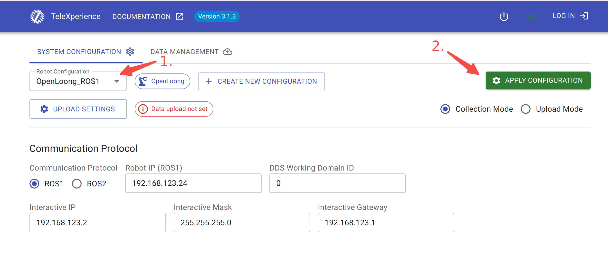

# io_teleop_v3_ros1_ws

## Install Dependencies

1. ROS1 required!

2. 
```
cd TeleXperience_robot_ros1_ws
./install_dependencies.sh
```

## Build

```bash
./build.sh
```


## Run with Simulation Environment
connect wifi to TeleXperience wifi, visit `10.42.0.3:7876`, switch to OpenLoong_ROS1 config



Set your computer wired connection IP as 192.168.123.24

Connect your computer to TeleBox Interactive Port with a network cable


``` bash
./run_Gen_sim.sh
```

press `RESTART TELEBOX` button in VR webview panal or APPLY CONFIGURATION in `192.168.123.2:7876`

Hold **both** vr controllers make sure **both** green signal lights are on, 

then press `START TELEOP` button and press button `A` to start sync.

#### Tips:

For new robot test:

You can add new robot files folder in `src/io_teleop_robot_control_node/io_teleop_robot_descriptions`

Upload the zipped robot files folder via `192.168.123.2:7876` and edit the configs.

**Change ROBOT_NAME in run_Gen_sim.sh**

